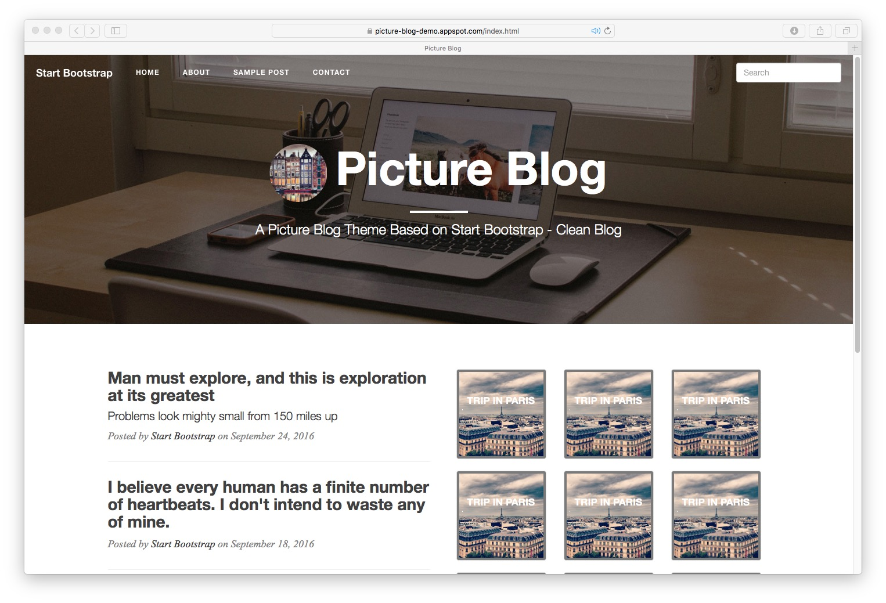

# picture-blog
A Picture Blog Theme Based on Start Bootstrap - Clean Blog

## Demo
[Live Demo](http://simple-personal-blog.appspot.com/)

Actually the 'live' version requires a little js and python to back as CMS system to manage the blog.
If you are interested, this is the source code.
[source code](https://github.com/laalaguer/simple-personal-blog)
## What is this
A HTML5 personal blog template, has pictures display on the front page.

## What is Added
I add some thumbnails and preview to make the site look better. Also modify the sample post page to contain sidebar.

## Credits
The original code, contributers are here, thanks a lot for the coder.
[Start Bootstrap](http://startbootstrap.com/) - [Clean Blog](http://startbootstrap.com/template-overviews/clean-blog/)

